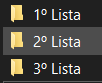
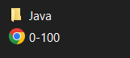

# Exercícios resolvidos

Esta ideia de realizar exercícios é minha e de um amigo, praticamos resolvendo problemas simples ou complexos, estou versionando porque vejo que alguns tem grande chances de se transformar em um projeto maior.

Cada pasta é uma lista ou exercício, dentro você vai encontrar os indices juntamente com os enunciados em um arquivo que pode ser em texto, pdf ou html, e logo acima a linguagem utilizada para realização da atividade.

